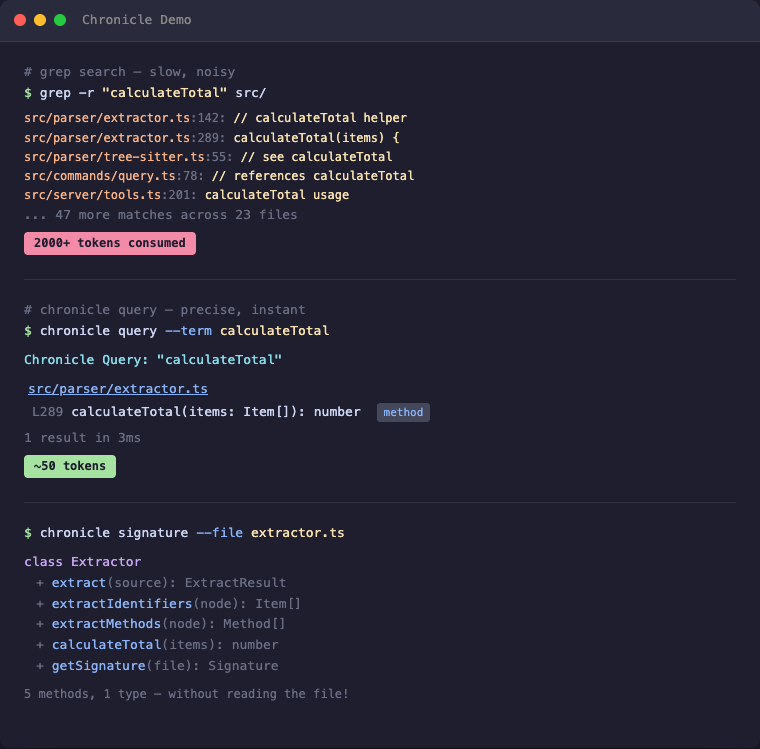
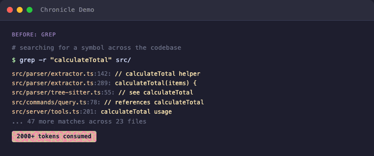
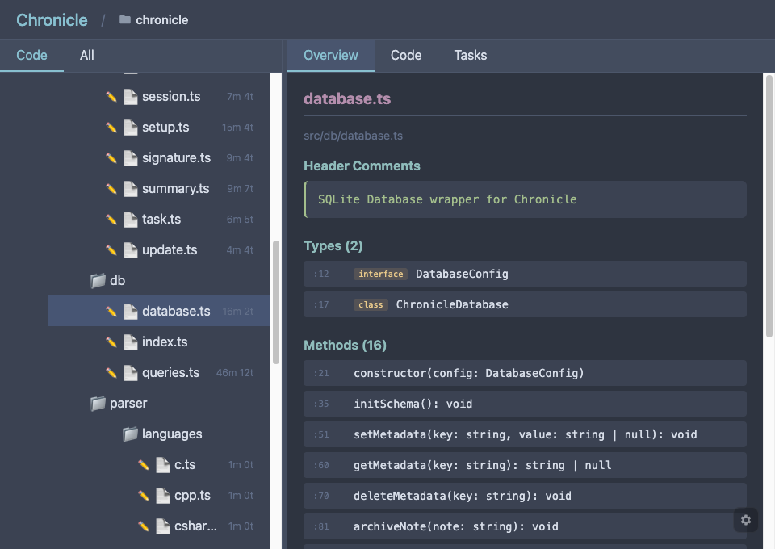
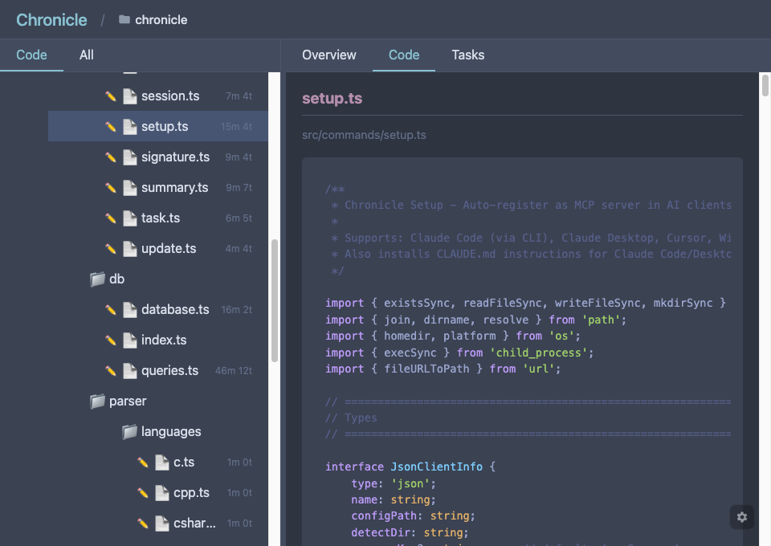

# Chronicle

[](https://www.npmjs.com/package/@tensakulabs/chronicle)
[](LICENSE)
[](https://nodejs.org/)
[](https://modelcontextprotocol.io/)

**Stop wasting 80% of your AI's context window on code searches.**

Chronicle is an MCP server that gives AI coding assistants instant access to your entire codebase through a persistent, pre-built index. Works with any MCP-compatible AI assistant: Claude Code, Claude Desktop, Cursor, Windsurf, Gemini CLI, VS Code Copilot, and more.



<details>
<summary>Animated version</summary>



</details>

## The Problem

Every time your AI assistant searches for code, it:
- **Greps** through thousands of files → hundreds of results flood the context
- **Reads** file after file to understand the structure → more context consumed
- **Forgets** everything when the session ends → repeat from scratch

A single "Where is X defined?" question can eat 2,000+ tokens. Do that 10 times and you've burned half your context on navigation alone.

## The Solution

Index once, query forever:

```
# Before: grep flooding your context
AI: grep "PlayerHealth" → 200 hits in 40 files
AI: read File1.cs, File2.cs, File3.cs...
→ 2000+ tokens consumed, 5+ tool calls

# After: precise results, minimal context
AI: chronicle_query({ term: "PlayerHealth" })
→ Engine.cs:45, Player.cs:23, UI.cs:156
→ ~50 tokens, 1 tool call
```

**Result: 50-80% less context used for code navigation.**

## Why Not Just Grep?

| | Grep/Ripgrep | Chronicle |
|---|---|---|
| **Context usage** | 2000+ tokens per search | ~50 tokens |
| **Results** | All text matches | Only identifiers |
| **Precision** | `log` matches `catalog`, `logarithm` | `log` finds only `log` |
| **Persistence** | Starts fresh every time | Index survives sessions |
| **Structure** | Flat text search | Knows methods, classes, types |

**The real cost of grep**: Every grep result includes surrounding context. Search for `User` in a large project and you'll get hundreds of hits — comments, strings, partial matches. Your AI reads through all of them, burning context tokens on noise.

**Chronicle indexes identifiers**: It uses Tree-sitter to actually parse your code. When you search for `User`, you get the class definition, the method parameters, the variable declarations — not every comment that mentions "user".

## How It Works

1. **Index your project once** (~1 second per 1000 files)
   ```
   chronicle_init({ path: "/path/to/project" })
   ```

2. **AI searches the index instead of grepping**
   ```
   chronicle_query({ term: "Calculate", mode: "starts_with" })
   → All functions starting with "Calculate" + exact line numbers

   chronicle_query({ term: "Player", modified_since: "2h" })
   → Only matches changed in the last 2 hours
   ```

3. **Get file overviews without reading entire files**
   ```
   chronicle_signature({ file: "src/Engine.cs" })
   → All classes, methods, and their signatures
   ```

The index lives in `.chronicle/index.db` (SQLite) — fast, portable, no external dependencies.

## Features

- **Screenshots**: Cross-platform screenshot capture (fullscreen, window, region) with auto-path for instant AI viewing
- **Smart Extraction**: Uses Tree-sitter to parse code properly — indexes identifiers, not keywords
- **Method Signatures**: Get function prototypes without reading implementations
- **Project Summary**: Auto-detected entry points, main classes, language breakdown
- **Incremental Updates**: Re-index single files after changes
- **Cross-Project Links**: Query across multiple related projects
- **Time-based Filtering**: Find what changed in the last hour, day, or week
- **Project Structure**: Query all files (code, config, docs, assets) without filesystem access
- **Session Notes**: Leave reminders for the next session — persists in the database
- **Task Backlog**: Built-in task management that lives with your code index — no external tools needed
- **Auto-Cleanup**: Excluded files (e.g., build outputs) are automatically removed from index

## Supported Languages

| Language | Extensions |
|----------|------------|
| C# | `.cs` |
| TypeScript | `.ts`, `.tsx` |
| JavaScript | `.js`, `.jsx`, `.mjs`, `.cjs` |
| Rust | `.rs` |
| Python | `.py`, `.pyw` |
| C | `.c`, `.h` |
| C++ | `.cpp`, `.cc`, `.cxx`, `.hpp`, `.hxx` |
| Java | `.java` |
| Go | `.go` |
| PHP | `.php` |
| Ruby | `.rb`, `.rake` |

## Quick Start

### 1. Install & Register

```bash
npm install -g @tensakulabs/chronicle
chronicle setup
```

`chronicle setup` automatically detects and registers Chronicle with your installed AI clients (Claude Code, Claude Desktop, Cursor, Windsurf, Gemini CLI, VS Code Copilot). To unregister: `chronicle unsetup`.

### 2. Or register manually with your AI assistant

**For Claude Code** (`~/.claude/settings.json` or `~/.claude.json`):
```json
{
  "mcpServers": {
    "chronicle": {
      "type": "stdio",
      "command": "chronicle",
      "env": {}
    }
  }
}
```

**For Claude Desktop** (`%APPDATA%/Claude/claude_desktop_config.json` on Windows):
```json
{
  "mcpServers": {
    "chronicle": {
      "command": "chronicle"
    }
  }
}
```

> **Note:** The server name in your config determines the MCP tool prefix. Use `"chronicle"` as shown above — this gives you tool names like `chronicle_query`, `chronicle_signature`, etc.

**For Gemini CLI** (`~/.gemini/settings.json`):
```json
{
  "mcpServers": {
    "chronicle": {
      "command": "chronicle"
    }
  }
}
```

**For VS Code Copilot** (run `MCP: Open User Configuration` in Command Palette):
```json
{
  "servers": {
    "chronicle": {
      "type": "stdio",
      "command": "chronicle"
    }
  }
}
```

### 3. Make your AI actually use it

Add to your AI's instructions (e.g., `~/.claude/CLAUDE.md` for Claude Code):

```markdown
## Chronicle — Use for ALL code searches!

**Before using Grep/Glob, check if `.chronicle/` exists in the project.**

If yes, use Chronicle instead:
- `chronicle_query` — Find functions, classes, variables by name
- `chronicle_signature` — Get all methods in a file with line numbers
- `chronicle_signatures` — Get methods from multiple files (glob pattern)
- `chronicle_summary` — Project overview with entry points

If no `.chronicle/` exists, offer to run `chronicle_init` first.
```

### 4. Index your project

Ask your AI: *"Index this project with Chronicle"*

Or manually in the AI chat:
```
chronicle_init({ path: "/path/to/your/project" })
```

## Available Tools

| Tool | Description |
|------|-------------|
| `chronicle_init` | Index a project (creates `.chronicle/`) |
| `chronicle_query` | Search by term (exact/contains/starts_with) |
| `chronicle_signature` | Get one file's classes + methods |
| `chronicle_signatures` | Get signatures for multiple files (glob) |
| `chronicle_update` | Re-index a single changed file |
| `chronicle_remove` | Remove a deleted file from index |
| `chronicle_summary` | Project overview |
| `chronicle_tree` | File tree with statistics |
| `chronicle_describe` | Add documentation to summary |
| `chronicle_link` | Link another indexed project |
| `chronicle_unlink` | Remove linked project |
| `chronicle_links` | List linked projects |
| `chronicle_status` | Index statistics |
| `chronicle_scan` | Find indexed projects in directory tree |
| `chronicle_files` | List project files by type (code/config/doc/asset) |
| `chronicle_note` | Read/write session notes (persists between sessions) |
| `chronicle_session` | Start session, detect external changes, auto-reindex |
| `chronicle_viewer` | Open interactive project tree in browser |
| `chronicle_task` | Create, read, update, delete tasks with priority and tags |
| `chronicle_tasks` | List and filter tasks by status, priority, or tag |
| `chronicle_screenshot` | Take a screenshot (fullscreen, window, region) |
| `chronicle_windows` | List open windows for screenshot targeting |

## Time-based Filtering

Track what changed recently with `modified_since` and `modified_before`:

```
chronicle_query({ term: "render", modified_since: "2h" })   # Last 2 hours
chronicle_query({ term: "User", modified_since: "1d" })     # Last day
chronicle_query({ term: "API", modified_since: "1w" })      # Last week
```

Supported formats:
- **Relative**: `30m` (minutes), `2h` (hours), `1d` (days), `1w` (weeks)
- **ISO date**: `2026-01-27` or `2026-01-27T14:30:00`

## Project Structure Queries

Chronicle indexes ALL files in your project (not just code):

```
chronicle_files({ path: ".", type: "config" })  # All config files
chronicle_files({ path: ".", type: "test" })    # All test files
chronicle_files({ path: ".", pattern: "**/*.md" })  # All markdown files
chronicle_files({ path: ".", modified_since: "30m" })  # Changed this session
```

File types: `code`, `config`, `doc`, `asset`, `test`, `other`, `dir`

## Session Notes

Leave reminders for the next session:

```
chronicle_note({ path: ".", note: "Test the glob fix after restart" })  # Write
chronicle_note({ path: ".", note: "Also check edge cases", append: true })  # Append
chronicle_note({ path: "." })                                              # Read
chronicle_note({ path: ".", clear: true })                                 # Clear
```

Notes are stored in `.chronicle/index.db` and persist indefinitely.

## Task Backlog

Keep your project tasks right next to your code index:

```
chronicle_task({ path: ".", action: "create", title: "Fix parser bug", priority: 1, tags: "bug" })
chronicle_task({ path: ".", action: "update", id: 1, status: "done" })
chronicle_task({ path: ".", action: "log", id: 1, note: "Root cause: unbounded buffer" })
chronicle_tasks({ path: ".", status: "active" })
```

**Priorities**: 🔴 high, 🟡 medium, ⚪ low  
**Statuses**: `backlog → active → done | cancelled`

## Screenshots

```
chronicle_screenshot()                                              # Full screen
chronicle_screenshot({ mode: "active_window" })                     # Active window
chronicle_screenshot({ mode: "window", window_title: "VS Code" })   # Specific window
chronicle_windows({ filter: "chrome" })                             # Find window titles
```

Cross-platform: Windows (PowerShell), macOS (screencapture), Linux (maim/scrot).

## Interactive Viewer

```
chronicle_viewer({ path: "." })
```

Opens `http://localhost:3333` with an interactive file tree, file signatures, live reload, and git status icons.

Close with `chronicle_viewer({ path: ".", action: "close" })`





## CLI Usage

```bash
chronicle scan ~/projects       # Find all indexed projects
chronicle init ./myproject      # Index a project from command line
```

## Performance

| Project Size | Files | Items | Index Time | Query Time |
|-------------|-------|-------|------------|------------|
| Small | ~20 | 1,200 | <1s | 1-5ms |
| Medium | ~50 | 1,900 | <1s | 1-5ms |
| Large | ~100 | 3,000 | <1s | 1-5ms |
| XL | ~500 | 4,100 | ~2s | 1-10ms |

## Technology

- **Parser**: [Tree-sitter](https://tree-sitter.github.io/) — real parsing, not regex
- **Database**: SQLite with WAL mode — fast, single file, zero config
- **Protocol**: [MCP](https://modelcontextprotocol.io/) — works with any compatible AI

## Project Structure

```
.chronicle/              ← Created in YOUR project
├── index.db             ← SQLite database
└── summary.md           ← Optional documentation

chronicle/               ← This repository
├── src/
│   ├── commands/        ← Tool implementations
│   ├── db/              ← SQLite wrapper
│   ├── parser/          ← Tree-sitter integration
│   └── server/          ← MCP protocol handler
└── build/               ← Compiled output
```

## Contributing

PRs welcome.

## License

MIT © 2026 Tensaku Labs
